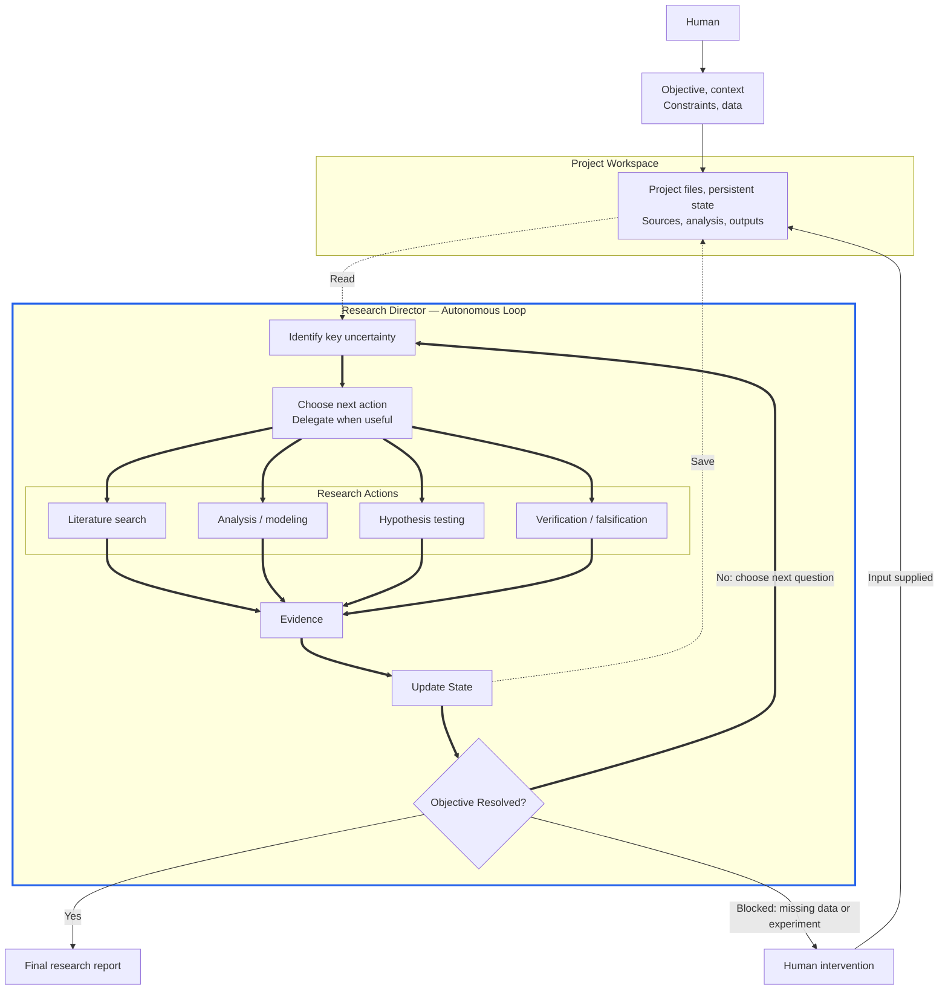

# Autonomous Research Architecture

The director selects useful actions and repeats the evidence-driven loop. The workspace preserves progress across runs.

```mermaid
flowchart TD
    Human["Human"] --> Input["Objective, context<br/>Constraints, data"]

    subgraph Workspace["Project Workspace"]
        Files["Project files, persistent state<br/>Sources, analysis, outputs"]
    end
    Input --> Files

    subgraph Director["Research Director — Autonomous Loop"]
        Uncertainty["Identify key uncertainty"] ==> Choose["Choose next action<br/>Delegate when useful"]

        subgraph Actions["Research Actions"]
            Search["Literature search"]
            Analyze["Analysis / modeling"]
            Test["Hypothesis testing"]
            Verify["Verification / falsification"]
        end

        Choose ==> Search
        Choose ==> Analyze
        Choose ==> Test
        Choose ==> Verify
        Search ==> Evidence["Evidence"]
        Analyze ==> Evidence
        Test ==> Evidence
        Verify ==> Evidence
        Evidence ==> Update["Update State"] ==> Resolved{"Objective Resolved?"}
        Resolved ==>|No: choose next question| Uncertainty
    end

    Files -.->|Read| Uncertainty
    Update -.->|Save| Files
    Resolved -->|Yes| Report["Final research report"]
    Resolved -->|Blocked: missing data or experiment| Intervention["Human intervention"]
    Intervention -->|Input supplied| Files

    style Director stroke:#2563eb,stroke-width:3px
```
