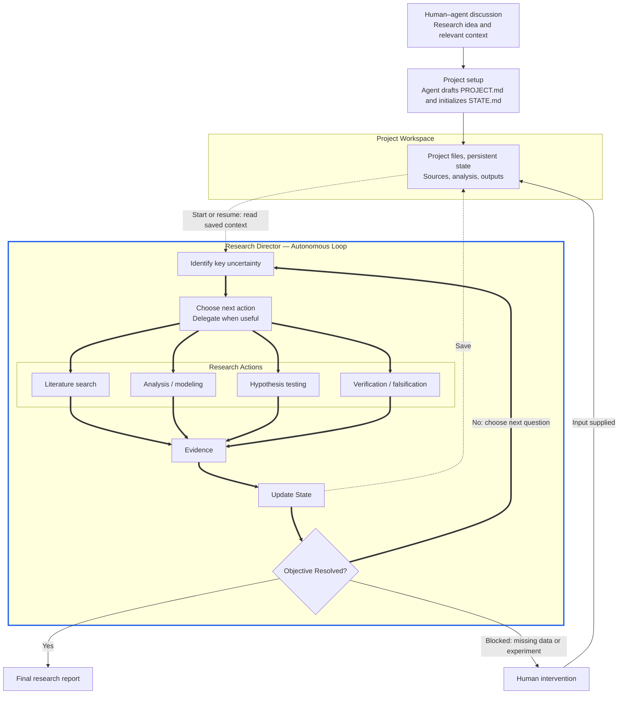

# Autonomous Research Architecture

A human and agent discuss a research idea; the agent translates it into the project brief and initial state. The director then selects useful actions and repeats the evidence-driven loop. The workspace preserves progress across runs. Both canonical prompts are in [README.md](README.md#start-a-project).

